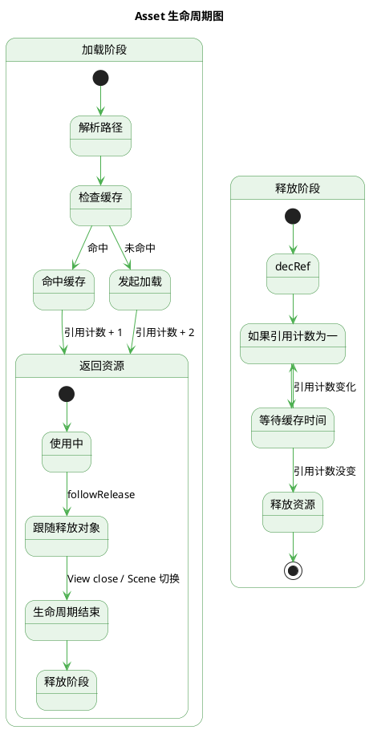

## 介绍

`mk.asset` 负责：

-   统一加载接口为：`get` 和 `getDir`。

-   兼容三种加载场景：本地资源、远程资源、编辑器（EDITOR）
-   管理引用计数与延迟回收，避免短时间内重复加载释放同一资源
-   支持资源跟随释放，把资源与对象的生命周期绑定
-   释放时清理资源的动态合图（如果启用）
-   路径优化：自动处理图片后缀（`SpriteFrame` / `Texture2D`），自动去掉文件扩展名

## 方法

### get

get 接口用于加载单个资源，支持本地、远程、编辑器环境

#### 参数

```ts
get(pathStr_, type_, target_, config_?)
```

-   `pathStr_`: 资源路径

    -   **路径类型**

        路径可以传递多种格式，这里以 `asset/resources/test/image.png` 举例

        1. 全路径：`db://resources/test/image.png`

            这里会默认后`db://`后的第一个`/`前的文本为 bundle 名，示例中为 `resources`

        1. bundle 内路径：`test/image.png`，但是需要在 `config_` 参数传递 bundle 名，稍后会知道

    -   **路径优化**

        除了两种路径格式外，资源路径也做了格外的优化

        -   可传递后缀名： 例如上方举例的路径带有 `.png`，在加载本地资源时框架会自动去除

        -   图片格式补充后缀名：默认情况下，加载图片资源需要带有 `/spriteFrame` 或 `/texture` 后缀，
            如果你没加后缀的情况下，框架会通过第二个 `type_` 参数自动为你添加后缀

    -   **编辑器环境**

        在编辑器环境下加载资源，你必须传递 db 路径，例如 `'db://xxx/xxx.png'`

-   `type_`: 资源类型，例如 Prefab, SpriteFrame, Texture2D 等...

-   `target_`: 资源跟随释放对象

    不止 `mk.asset`，框架所有加载资源的地方都要求你传递它，例如音频、UI 注册

    什么是 **资源跟随释放对象**？ 资源跟随释放对象的类型是 `MKRelease_.TypeFollowReleaseObject<Asset>`，有两个函数
    

    followRelease: `mk.asset` 会在资源加载完成时调用跟随释放对象的 `followRelease`，然后由跟随释放对象自己决定什么时候调用资源的 `decRef`

    目前框架中已扩展的类型有 `mk.LifeCycle` 和 `mk.Bundle_.BundleManageBase`

    -   `mk.LifeCycle`

        作为 `mk.LifeCycle` 的子类，如果你传递 `mk.ViewBase`, `mk.StaticViewBase`, `mk.SceneDrive` 类型的对象，资源会在生命周期的 lateClose 中被减少引用计数

    -   `mk.Bundle_.BundleManageBase`

        bundle 管理器，你可以在下一篇文章中了解它，如果你传递这个类型的对象，资源会在从当前 bundle 的 scene 切换到其他 bundle 的 scene 后，
        资源会被减少引用计数

-   `config_`: 加载配置，可选
-   `config_.bundleStr`: bundle 名

    默认值：编辑器：resources，运行时：当前场景所属 bundle

-   `config_.progressFunc`: 进度回调
-   `config_.completedFunc`: 完成回调
-   `config_.remoteOption`: 远程配置，存在则为远程资源，配置数据参考[官方文档](https://docs.cocos.com/creator/3.8/manual/zh/asset/dynamic-load-resources.html#%E5%8A%A0%E8%BD%BD%E8%BF%9C%E7%A8%8B%E8%B5%84%E6%BA%90%E5%92%8C%E8%AE%BE%E5%A4%87%E8%B5%84%E6%BA%90)
-   `config_.retryNum`: 失败重试次数，默认值为 `GlobalConfig.Asset.Config.retryCountOnLoadFailureNum`

### getDir

getDir 接口用于加载文件夹资源，支持本地、远程环境

#### 参数

getDir 参数和 get 接口基本一致，`pathStr_` 传递文件夹路径即可

```ts
getDir(pathStr_, type_, target_, config_?)
```

### release

强制释放资源或者资源列表

#### 参数

```ts
release(asset_);
```

-   `asset_`: 资源或资源列表

---

## 常见问题（FAQ）

**Q：为什么有时资源已经被释放导致报错？**

1. 检查你的跟随释放对象是否正确；

2. 检查关闭模块时是否没有清理对资源的引用导致第二次复用模块时使用到了已经被释放的资源

**Q：为什么有时资源没释放？**

检查是否正确传入了 `target_`（跟随释放对象）。资源没被引用时会在缓存时间后才释放，配置在 `GlobalConfig.Asset.config.cacheLifetimeMsNum`

**Q：远程资源需要手动释放吗？**

如果你在加载时传递了 `target_`（跟随释放对象），资源会由 `target_` 控制何时释放。
`target_` 传递 `null`，则代表手动管理，需手动调用 `decRef` 或 `mk.asset.release`。

**Q：数组资源如何释放？**

和 `get` 得到的资源一致

**Q：我能直接用引擎提供的 `assetManager` 加载资源吗？**

可以，但会绕过引用计数与跟随释放机制，使用不当容易造成内存泄漏。推荐始终用 `mk.asset` 提供的封装接口。

---

## 生命周期图

参考图示可以帮助你更容易理解


