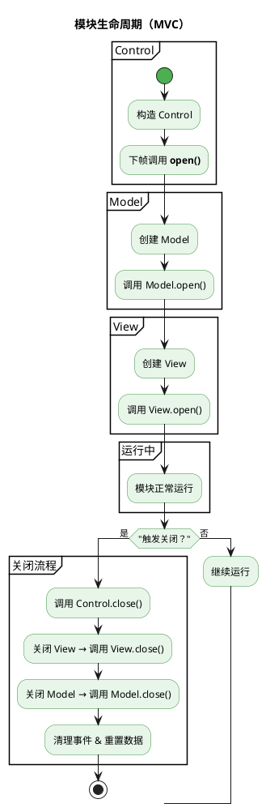
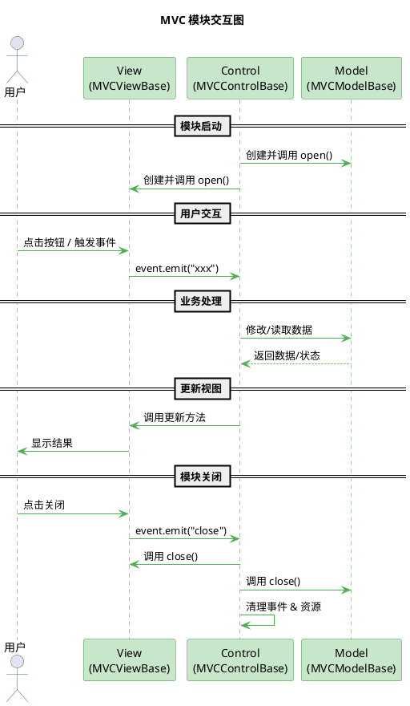

当你需要写一个界面模块（例如背包、资源窗口、排行榜等），常常会遇到几个痛点：

-   **数据、界面和逻辑混在一起**，维护困难
-   **UI 生命周期复杂**，容易忘记销毁或清理事件
-   **多人协作** 时，职责边界不清晰

为了解决这些问题，我们提供了一个简洁的 **MVC 模块框架**：

-   **Model**：负责数据
-   **View**：负责界面和事件
-   **Control**：负责协调 Model 与 View

这样，你写的每个模块都是 **独立、可控、易维护** 的。

---

## 我能得到什么帮助？

使用 MVC 模块，你可以：

✅ **快速构建 UI 模块**：只关心“写逻辑”，不需要操心生命周期管理  
✅ **清晰的职责划分**：数据（Model）、界面（View）、逻辑（Control）互不干扰  
✅ **自动管理资源**：关闭时自动销毁监听、清理数据  
✅ **可扩展**：模块可以单独替换、复用，互不影响

---

## 快速开始

一个完整的 MVC 模块通常由三部分组成：

1. **Model（数据层）**

    - 保存和管理数据
    - 生命周期与模块绑定

2. **View（视图层）**

    - 管理 UI 节点和事件
    - 只读访问 Model 数据

3. **Control（控制层）**
    - 负责创建 Model 和 View
    - 处理业务逻辑与关闭流程

---

### 第一步：定义 Model

```ts
class MyModuleModel extends mk.MVCModelBase {
    gold = 0;

    open() {
        console.log('Model 已创建');
    }

    close() {
        console.log('Model 已销毁');
    }
}
```

特点：

-   `open()` 在实例化时调用
-   `close()` 在模块关闭时调用
-   默认会 **自动重置数据**（避免旧数据污染下次使用）

---

### 第二步：定义 View

```ts
class MyModuleView extends mk.MVCViewBase<MyModuleModel> {
    static async new() {
        mk.uiManage.regis(MyModuleView, 'db://assets/MyModule.prefab', null);
        return mk.uiManage.open(MyModuleView);
    }

    protected open() {
        console.log('View 打开');
        this.node.getChildByName('按钮_关闭')!.once('click', () => this.close(), this);
    }

    close() {
        console.log('View 关闭');
        mk.uiManage.unregis(MyModuleView);
    }
}
```

特点：

-   `event` 可用于向 Control 派发事件
-   `open()` 在 UI 打开时调用
-   `close()` 在 UI 关闭时调用

---

### 第三步：定义 Control

```ts
class MyModuleControl extends mk.MVCControlBase<MyModuleModel, MyModuleView> {
    protected async open() {
        this._model = await MyModuleModel.new();
        this._view = (await MyModuleView.new())!;

        // 当视图触发关闭时，控制器负责关闭整个模块
        this._view.event.once('close', () => this.close());
    }
}
```

特点：

-   `Control` 是模块的 **入口**
-   负责同时管理 Model 和 View
-   关闭时，会依次销毁 Model、View 并清理事件

---

## 生命周期



---

## 用户交互



---

## 一个完整示例

```ts
class ShopControl extends mk.MVCControlBase<ShopModel, ShopView> {
    protected async open() {
        this._model = await ShopModel.new();
        this._view = (await ShopView.new())!;

        this._view.event.once('buy', (itemId) => {
            this._model.gold -= 100; // 扣钱
            console.log(`购买物品 ${itemId}`);
        });

        this._view.event.once('close', () => this.close());
    }
}

class ShopModel extends mk.MVCModelBase {
    gold = 1000;
}

class ShopView extends mk.MVCViewBase<ShopModel> {
    static async new() {
        mk.uiManage.regis(ShopView, 'db://assets/Shop.prefab', null);
        return mk.uiManage.open(ShopView);
    }
}
```

> **使用方式**
>
> ```ts
> const shop = new ShopControl(); // 自动执行 open()
> ```

---

## 总结

-   **Model** → 负责数据
-   **View** → 负责界面与事件
-   **Control** → 负责协调与关闭

使用 MVC，你只需要写业务逻辑，**生命周期管理、事件解绑、数据清理都交给框架**。
