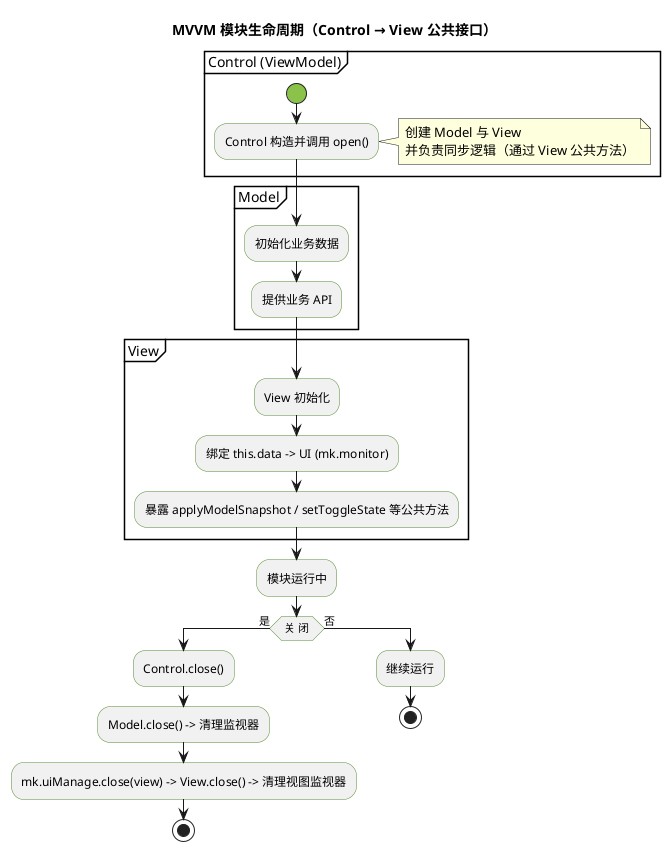
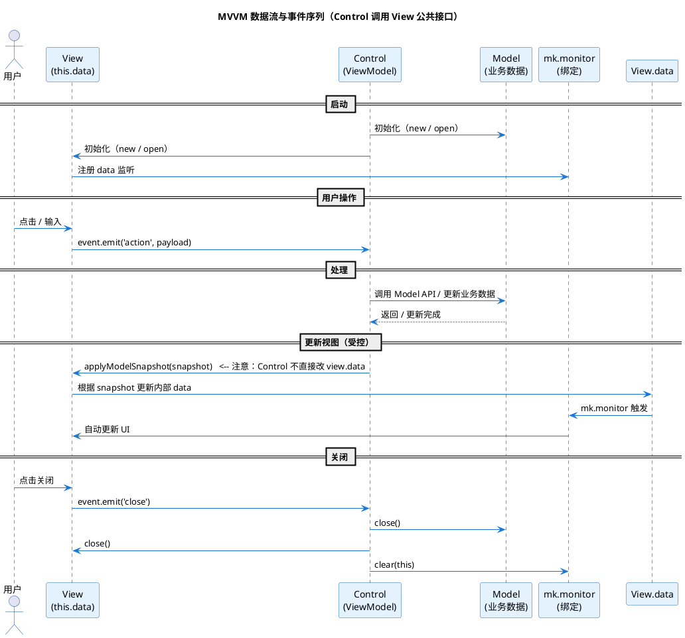

本文提供工程 MVVM 规范与模板。设计原则简明：

-   **View** 负责展示（持有 view-only `data` 并绑定 UI，公开受控的更新接口）
-   **Control** 作为 **ViewModel / 命令中心**，负责处理用户输入、调用 Model API、并通过 **View 的公开函数** 请求 View 更新展示态
-   **Model** 保持业务数据与方法的权威性（网络、持久化、校验）

关键约束：**Control 不直接修改 `view.data`**；所有 View 的展示更新必须通过 View 的公开函数或事件来完成（Control 可以把数据快照/视图模型传给 View 的公开方法，由 View 自行更新 `data` 并触发绑定）。

---

## 为什么采用这个模式（收益）

-   展示态（UI 临时状态）与业务态分离，避免状态冲突。
-   所有业务写入通过单一路径（Control → Model → Control → View\.publicUpdate），便于校验、埋点与回滚。
-   `mk.monitor` 与 `ToolMonitorDataMethod` 自动完成数据到 UI 的同步，显著减少样板代码。
-   更利于单元测试：Model 与 Control 可独立测试，View 只负责渲染并暴露安全的更新接口。

---

## 核心职责（简明）

-   **View**

    -   持有 `data`（view-only）：动画、输入草稿、渲染缓存、分页/滚动位置等。
    -   使用 `mk.monitor.on` / `ToolMonitorDataMethod` 将 `data` 与节点绑定（View 自己监听自己的 `data`）。
    -   暴露明确的公共接口（例如 `applyModelSnapshot(snapshot)`、`setToggleState(v)`、`refreshList(items)`），**禁止外部直接修改 `data`**。
    -   将用户操作通过 `this.event` 发出，交由 Control 处理。

-   **Control（ViewModel）**

    -   接收 View 的事件并执行业务逻辑（调用 Model API）。Control 是唯一写 Model 的入口。
    -   将 Model 的权威数据转换成“展示快照/视图模型”，**通过调用 View 的公开函数**把展示数据交给 View（例如 `this._view.applyModelSnapshot(snapshot)`），由 View 自行把 snapshot 映射到 `data`。Control 不直接改 `this._view.data`。
    -   管理模块生命周期、统一清理 `mk.monitor`。

-   **Model**

    -   保存业务数据并提供变更 API（网络、持久化、校验在此实现）。
    -   在 `close()` 时负责清理自身的监视器并可重置数据（`_isResetData`）。

---

## 快速上手（受约束的三步模板）

下面给出可直接复制粘贴的模板，确保 Control 仅通过事件与 View 的公共方法交互，不直接修改 `view.data`。

### 1. Model（业务层）

```ts
class MyModel extends mk.MVCModelBase {
    items: string[] = [];
    gold = 1000;

    async buy(itemId: string) {
        // 业务校验 / 网络 / 持久化
        this.gold -= 100;
        this.items.push(itemId);
    }

    async setToggle(v: boolean) {
        // 示例 API：权限校验或上报
        this._isSomething = v;
    }
}
```

### 2. View（视图层）

使用自身 data 作为视图绑定；对外提供更新接口

```ts
class MyView extends mk.MVCViewBase<MyModel> {
    // view-only 数据（private by convention）
    data = new (class {
        label = '0';
        isToggled = false;
        list: string[] = [];
    })();

    protected open() {
        // 关闭按钮发事件给 Control
        this.node.getChildByName('btnClose')!.once('click', () => this.event.emit('close'), this);

        // 绑定 data -> UI（View 自己负责）
        mk.monitor.on(
            this.data,
            'label',
            (v) => {
                this.node.getChildByPath('Label').getComponent(Label)!.string = v;
            },
            this
        );

        mk.monitor.on(
            this.data,
            'isToggled',
            (v) => {
                this.node.getChildByPath('Toggle').getComponent(Toggle)!.isChecked = v;
            },
            this
        );

        ToolMonitorDataMethod.array.Default.on(
            this.data,
            'list',
            this.node.getChildByPath('ScrollView'),
            {
                isRecycle: true,
                eventChildUpdate: (() => {
                    const ev = new EventHandler();
                    ev.target = this.node;
                    ev.component = 'MyView';
                    ev.handler = 'onRenderListItem';
                    return ev;
                })(),
            }
        );
    }

    // 公共方法：由 Control 调用以更新展示（Control 不直接改 this.data）
    public applyModelSnapshot(snapshot: { gold?: number; items?: string[] }) {
        if (snapshot.gold !== undefined) {
            this.data.label = String(snapshot.gold);
        }
        if (snapshot.items !== undefined) {
            this.data.list = [...snapshot.items]; // 触发 monitor
        }
    }

    // 也可以对外提供更小粒度的公有方法
    public setToggleState(v: boolean) {
        this.data.isToggled = v;
    }

    onRenderListItem(node: Node, item: string) {
        node.getComponent(Label)!.string = item;
    }
}
```

要点：对外仅暴露受控方法（`applyModelSnapshot`、`setToggleState` 等），内部才直接操作 `this.data`，从而保证更新路径可控。

### 3. Control（ViewModel / 命令中心）

负责与 Model 通信，仅调用 View 的事件与公开函数

```ts
class MyControl extends mk.MVCControlBase<MyModel, MyView> {
    protected async open() {
        this._model = await MyModel.new();
        this._view = (await MyView.new())!;

        // 初始同步（Control 不直接改 view.data，而是调用 View 公共函数）
        this.syncModelToView();

        // 监听 View 的用户事件
        this._view.event.on('buy', async (itemId: string) => {
            await this.handleBuy(itemId);
        });

        this._view.event.on('toggleChanged', async (v: boolean) => {
            await this.handleToggle(v);
        });

        this._view.event.on('close', () => this.close());
    }

    private async handleBuy(itemId: string) {
        await this._model.buy(itemId); // 写 Model
        this.syncModelToView(); // 将 Model 转为 snapshot 并委托 View 更新
    }

    private async handleToggle(v: boolean) {
        await this._model.setToggle(v);
        // 如果 toggle 直接影响展示，可以请求 View 更新
        this._view.setToggleState(this._model._isSomething);
    }

    private syncModelToView() {
        // 构建展示用 snapshot（纯数据，不包含函数或复杂引用）
        const snapshot = {
            gold: this._model.gold,
            items: this._model.items,
        };

        // 通过 View 的公开接口请求 View 更新（Control 不直接操作 view.data）
        this._view.applyModelSnapshot(snapshot);
    }
}
```

要点：所有 Model → View 的映射都委托给 View 的公开方法完成。Control 不访问或修改 `this._view.data`。

---

## 双向交互（Toggle / 输入框）——受控写入模式

双向交互仍然推荐走受控路径：

流程示例：

1. View 在 UI 事件时 `this.event.emit('toggleChanged', value)`；
2. Control 接收事件并校验、处理后调用 Model API（或 Control 维护的事务）；
3. Control 再调用 View 的公开方法（如 `setToggleState` 或 `applyModelSnapshot`）请求 View 更新 UI；

优点：所有写入被集中管理，便于加校验、节流、埋点与回滚。

示例（Toggle）：

```ts
// View: 发生切换时
toggleNode.on('click', () => this.event.emit('toggleChanged', this.data.isToggled));

// Control:
this._view.event.on('toggleChanged', async (v) => {
    await this._model.setToggle(v); // 写 Model
    this._view.setToggleState(this._model._isSomething); // 请求 View 更新
});
```

---

## 列表渲染要点

-   使用 `ToolMonitorDataMethod.array.Default.on` 绑定 `view.data` 的数组到 ScrollView（支持回收）。
-   Control 更新列表数据后，**通过 View 的公开方法**传入新数组（或 snapshot），例如 `this._view.applyModelSnapshot({ items: [...this._model.items] })`。
-   列表回调仅负责渲染（`onRenderListItem(node, data)`），不要在回调里修改 Model。

---

## 生命周期与资源清理（必须遵守）

-   `mk.MVCControlBase.close()` 的行为：等待 open 完成 → `model.close()` → `mk.uiManage.close(view)` → `mk.monitor.clear(this)`（清理 Control 注册的监视器）。
-   `mk.MVCModelBase.close()` 会 `mk.monitor.clear(this)` 并根据 `_isResetData` 重置数据。
-   注册 `mk.monitor.on` 时将 `target` 设为 `this`（Control 或 View），以便框架在 close 时自动清理。

示例（在 View 中）：

```ts
mk.monitor.on(this.data, 'label', handler, this); // target=this，框架会自动 clear
```

---

## 常见陷阱与最佳实践速览

-   **禁止 Control 直接修改 `view.data`**：使用 View 的公开函数更新展示态。
-   **所有业务写操作通过 Control → Model**（或通过 Model 的 API），负责人集中。
-   **集中同步**：将 Model → View 的映射写在 `syncModelToView()`（Control）并在内部委托给 View 的公共方法，保持逻辑一致性。
-   **数组变更要替换引用或使用 mk.monitor 支持的变更方法**，确保绑定触发。
-   **将临时 UI 状态放在 `View.data`**（动画、选择、缓存）。
-   **避免回环更新**：View 发事件 → Control 写 Model → Control 请求 View 更新，这样不会触发无限循环；如有必要用锁或旧值比较防止重复更新。
-   **使用 `this` 作为 mk.monitor 的 target**，框架会在 close 时自动清理监视器，降低内存泄漏风险。

---

## 图示（帮助理解）

### 模块生命周期



### 数据流与交互序列



---

## 总结

-   将展示态放到 `View.data`（由 View 自行维护），业务态放到 `Model`，控制与同步逻辑放到 `Control`（ViewModel）。
-   必须遵守**Control 只能通过 View 的事件与公开函数与 View 交互**、**Control 不直接写 `view.data`** 的约束，这样可以保证更新路径可控、职责清晰且更易维护。
-   `mk.monitor` 与 `ToolMonitorDataMethod` 将数据驱动 UI 的优势最大化，建议把 Model → View 的转换逻辑集中在 Control（构建 snapshot）并交由 View 执行最终的 `data` 更新。
