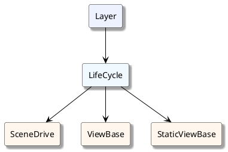

在框架中，视图组件的基类是 ViewBase 或 StaticViewBase，但是它们还有父类，下面就是它们的结构

-   Layer: 显示层级控制

-   LifeCycle: 组件的生命周期

-   SceneDrive：场景驱动（作为用户很少接触到它）

-   ViewBase：视图基类

-   StaticViewBase：静态视图基类

> 想更深入的了解这些类型可以展开菜单继续查看
