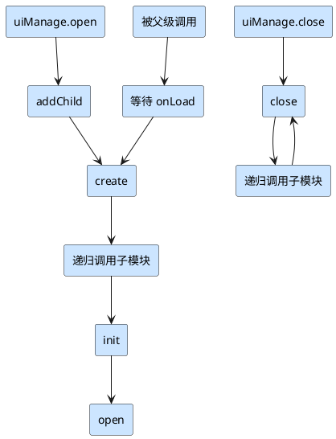

`LifeCycle` 继承自 `Layer`，用于实现生命周期管理，并作为视图父类提供通用逻辑，例如 **模块关闭后的数据清理、事件解绑、定时器销毁、资源释放** 等。

---

## 生命周期函数

在继承 `Component` 的生命周期函数（如 `onLoad`、`onEnable` 等）之外，`LifeCycle` 还扩展了自己的生命周期函数。

### 执行顺序



---

### `create`

**目标**：在节点展示之前初始化视图。

由于 `init` 和 `open` 都需要等待子模块生命周期执行，因此 **想要在展示前初始化视图，必须放在 `create` 中完成**。

---

### `init`

<Note type="warning" title="注意">
    `init` 不一定会被调用
</Note>

**目标**：带初始化数据的初始化回调，可被 **重复调用**。

触发条件：

1. 使用 `uiManage.open` 并传入 `init` 数据（非 `undefined`）时

    ```ts
    let module = (await mk.uiManage.open(NewComponent, {
        init: 123,
    }))!;
    ```

2. 手动调用：

    ```ts
    module.init(123);
    ```

典型场景：例如 **列表的 item**，可重复调用 `init` 来重置视图，而 `open` 只在模块打开时触发一次。

---

### `open`

**目标**：不依赖初始化数据的回调。

适合在此处执行：

-   注册事件监听
-   使用子模块
-   初始化 UI

---

### `close`

**目标**：模块关闭时的回调。

在此进行：

-   模块清理
-   状态/数据重置

---

## 额外接口

### `drive(initData)`

手动驱动生命周期函数执行。

> 使用场景：框架只会在 `uiManage.open` 或场景切换时驱动生命周期。若通过 `addComponent` 手动挂载了 `LifeCycle`，需要调用 `drive` 来触发。

---

### `followRelease(obj)`

-   **参数**：跟随释放的对象，类型为 `MKRelease_.TypeReleaseParamType & MKAudio_.PrivateUnit`

在模块 `lateClose` 时自动释放资源。

> 注意：如果加载资源时已声明为“跟随释放对象”，则无需再次调用。

---

### `cancelRelease(obj)`

-   **参数**：与 `followRelease` 相同

用于取消之前的跟随释放操作。

---

## 特殊机制

### 父类自启函数

`LifeCycle` 内置了以下函数作为 **父类自启函数**：
`onLoad`、`start`、`update`、`lateUpdate`、`onEnable`、`onDisable`、`onDestroy`、`create`、`init`、`open`、`close`、`lateClose`

👉 **无需手动 `super.xxx()` 调用父类方法**，执行顺序为 **父 → 子**。

---

### 自动清理机制

在 `lateClose` 阶段，框架会自动完成以下清理操作：

1. 重置 `this.data`（若为 `new class` 创建的对象）
2. 移除通过 `@property` 引用的音频单元
3. 执行 `this.unscheduleAllCallbacks()` 取消组件内定时器
4. 清理框架内 `EventTarget` 与 `_MKNetworkBase.MessageEvent` 的事件监听（若 target 为自身）
5. 清理 `monitor` 中绑定到自身的监听
6. 减少自身引用资源的引用计数
