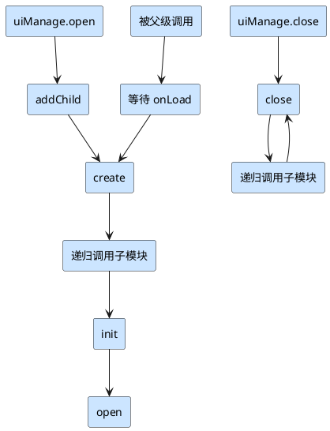

LifeCycle 继承于 Layer，实现了生命周期和作为视图父类的通用逻辑，例如关闭模块后的数据、事件、定时器、资源的清理操作

## 生命周期函数

除了原本 Component 的生命周期函数 onLoad, onEnable...等等，LifeCycle 也扩展了自己的生命周期函数

### 执行顺序



### create

**设计目标**：在节点展示之前初始化视图

从调用顺序可以看出，由于 init 和 open 都需要等待子模块生命周期，
所以如果想要在展示之前初始化视图那么只能在 create 进行，这也就是 create 的意义

### init

<Note type="warning" title="注意">
    init 并不会一定会被调用
</Note>

**设计目标**：使用初始化数据的初始化回调，可被重复调用

init 只会在两种情况下被调用：

1. 在使用 `uiManage.open` 传递初始化数据且数据不为 `undefined` 时，init 会被调用
    ```ts
    let module = (await mk.uiManage.open(NewComponent, {
        init: 123,
    }))!;
    ```
2. 在外部手动调用
    ```ts
    module.init(123);
    ```

例如列表的 item 对象，可以重复调用 init 重置视图，而 open 则只会在模块打开时调用一次

### open

**设计目标**：不使用初始化数据的初始化回调

你可以在这里进行事件监听、使用子级模块、初始化视图...

### close

**设计目标**：模块的关闭回调

可在此进行模块清理，重置操作

## 特殊机制

### 父类自启函数

LifeCycle 中设置了 `onLoad, start, update, lateUpdate, onEnable, onDisable, onDestroy, create, init, open, close, lateClose` 作为父类自启函数

意味着你不需要在 LifeCycle 子类中的这些函数内手动进行 `super.xxx` 调用父类的函数，函数的执行顺序为 **父 -> 子**

### 自动清理数据

在 LifeCycle 的 `lateClose` 中，框架进行了以下清理操作
