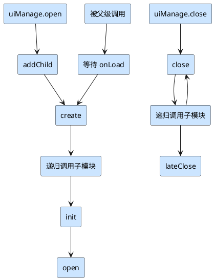

`mk.LifeCycle` 继承自 [`mk.Layer`](./layer)，用于实现生命周期管理，并作为视图父类提供通用逻辑，例如 **模块关闭后的数据清理、事件解绑、定时器销毁、资源释放** 等。

---

## 生命周期函数

在继承 `Component` 的生命周期函数（如 `onLoad`、`onEnable` 等）之外，`mk.LifeCycle` 还扩展了自己的生命周期函数。

### 执行顺序



---

### create

在节点展示之前初始化视图。

由于 `init` 和 `open` 都需要等待子模块生命周期执行，因此 **想要在展示前初始化视图，必须放在 `create` 中完成**。

---

### init

<Note type="warning" title="注意">
    `init` 只在存在初始化数据时被调用
</Note>

带初始化数据的初始化回调，可被 **重复调用**。

触发条件：

1. 使用 `mk.uiManage.open` 并传入 `init` 数据（非 `undefined`）时

    ```ts
    let module = (await mk.uiManage.open(NewComponent, {
        init: 123,
    }))!;
    ```

2. 手动调用：

    ```ts
    module.init(123);
    ```

典型场景：例如 **列表的 item**，可重复调用 `init` 来重置视图，而 `open` 只在模块打开时触发一次。

---

### open

不依赖初始化数据的回调。

适合在此处执行：

-   注册事件监听
-   使用子模块
-   初始化 UI

---

### close

模块关闭时的回调。

当执行 close 时当前模块的 open 流程未完成时，将中断 open

适合在此处执行：

-   定时器、缓动等清理操作

### lateClose

模块及子模块关闭后的回调。

代表子模块的的 close 和 lateClose 已被调用完毕。`mk.LifeCycle` 会在 lateClose 内执行[自动清理机制](./life-cycle#特殊机制/自动清理机制)

---

## 属性

### initData

模块的初始化数据，由 [外部传递](./life-cycle#生命周期函数/init)，无需手动赋值

#### 防止类型错误

由于 initData 是外部数据，怎么防止外部传递错误的类型数据？你只需要在自己的模块内声明类型即可，例如：

```ts
export class Test extends mk.ViewBase {
    initData!: { a: number };
}
```

当你这样设置后，外部就只能传递类型为 `{ a: number }` 的数据，在多人编码时作用很大

> 即使外部调用模块的 init 函数，因为设置了[父类自启函数](./life-cycle#特殊机制/父类自启函数)，`mk.LifeCycle` 父类也会自动赋值 initData，无需手动 `this.initData = data;`

### data

可自动重置的模块数据

如果它是一个 class 对象，那么它将在 lateClose 中自动重置，解决了复用模块时手动重置数据的痛点

例如：

```ts
export class Test extends mk.ViewBase {
    data = new (class {
        /** 菜单下标 */
        menuIndex = 0;
    })();
}
```

即使你的模块在运行中修改了 data 中的数据，例如用户切换菜单修改了 `this.data.menuIndex` 为 1，
在模块关闭后，`this.data.menuIndex` 数据会被重置为默认值 0

### eventTargetList

事件对象列表

当你使用框架的 `mk.EventTarget` 类型对象，或者 `mk.network.Websocket` 对象的 message 属性进行事件监听且 on 或 once 的 target\_
参数为 `mk.LifeCycle` 对象

那么 on 或 once 内会调用 `target_.eventTargetList.push(this)`，
当模块 lateClose 时将调用自身 eventTargetList 列表中所有事件对象的 `targetOff(this)` 取消绑定到自身的事件

### valid

有效状态，表示模块未在(关闭/关闭中)状态

### isStatic

是否为静态模块，及非 `mk.uiManage.open` 打开的模块

---

## 额外接口

### drive(initData)

手动驱动生命周期函数执行。

> 使用场景：框架只会在 `mk.uiManage.open` 或场景切换时驱动生命周期。若通过 `addComponent` 手动挂载了 `LifeCycle`，需要调用 `drive` 来触发。

---

### followRelease(obj)

-   **参数**：跟随释放的对象，类型为 `Release_.TypeReleaseParamType & Audio_.PrivateUnit`

传入参数将在模块 `lateClose` 时自动释放资源。具体类型如下

1.  节点：cc.Node
1.  资源：cc.Asset
1.  对象：必须存在 `release()` 函数的对象
1.  函数：Function
1.  音频单元：mk.Audio\_.Unit

> 注意：如果参数为资源，且加载此资源时已传递为“跟随释放对象”，则无需调用 `followRelease`

---

### cancelRelease(obj)

-   **参数**：与 `followRelease` 相同

用于取消之前的跟随释放操作。

---

## 特殊机制

### 父类自启函数

`LifeCycle` 内置了以下函数作为 **父类自启函数**：
`onLoad`、`start`、`update`、`lateUpdate`、`onEnable`、`onDisable`、`onDestroy`、`create`、`init`、`open`、`close`、`lateClose`

父类自启函数：**无需手动 `super.xxx()` 调用父类方法**，当函数被调用时，执行顺序为 **父函数 → 子函数**

---

### 自动清理机制

在 `lateClose` 阶段，框架会自动完成以下清理操作：

1. 重置 `this.data`（若为 `new class` 创建的对象）
2. 在音频组内移除通过 `@property` 引用的音频单元
3. 执行 `this.unscheduleAllCallbacks()` 取消组件内定时器
4. 清理框架内 `EventTarget` 与 `_MKNetworkBase.MessageEvent` 的事件监听（若 target 为自身）
5. 清理 `mk.monitor` 中绑定到自身的监听
6. 减少自身引用资源的引用计数
