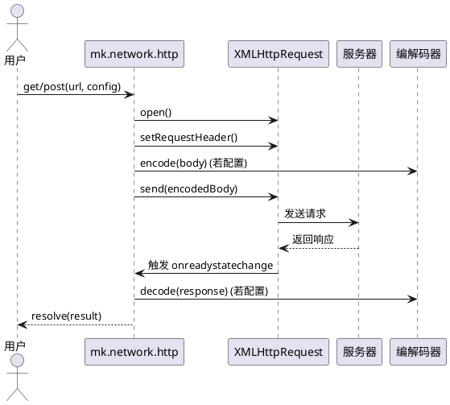

## 架构设计

### 核心思想

-   **双模式支持**：兼容 Cocos Creator 编辑器和原生运行时环境（通过 `sys.isNative` 区分）。
-   **编解码扩展**：通过 `MKCodecBase` 实现请求/响应数据的编解码，支持二进制、JSON、Base64 等。
-   **任意返回类型**：支持 `XMLHttpRequestResponseType` 所有类型（如 `text`、`arraybuffer`、`blob`、`json`、`document`）。
-   **事件驱动**：通过 `Promise` 封装异步请求，支持超时、回调等事件处理。

### 数据流图示



---

## 用户层接口

### 核心接口

#### `mk.network.http`

全局单例，提供 `GET` 和 `POST` 请求方法。

| 方法                                                | 描述           |
| --------------------------------------------------- | -------------- |
| `get(url: string, config?: Partial<Http_.Config>)`  | 发送 GET 请求  |
| `post(url: string, config?: Partial<Http_.Config>)` | 发送 POST 请求 |

#### `mk.network.Http_`

命名空间，提供配置类和类型定义。

| 类/类型       | 描述                       |
| ------------- | -------------------------- |
| `Config`      | 请求配置类                 |
| `MKCodecBase` | 编解码器基类（需用户继承） |

---

## API 详解

### `get` / `post`

#### 基础用法

```ts
// GET 请求
const response = await mk.network.http.get('https://api.example.com/data', {
    returnType: 'json',
    timeoutNum: 10000,
});

// POST 请求
const response = await mk.network.http.post('https://api.example.com/login', {
    body: JSON.stringify({ username: 'user', password: 'pass' }),
    header: { 'Content-Type': 'application/json' },
    returnType: 'json',
});
```

#### 返回值

-   成功时返回 `Promise<any>`（解析后的响应数据）
-   失败时返回 `Promise<null>`（超时、网络错误、状态码异常）

### `Http_.Config` 配置类

| 属性               | 类型                                                                        | 默认值 | 描述                                         |
| ------------------ | --------------------------------------------------------------------------- | ------ | -------------------------------------------- |
| `timeoutNum`       | `number`                                                                    | `5000` | 超时时间（毫秒）                             |
| `returnType`       | `XMLHttpRequestResponseType`                                                | -      | 返回数据类型（如 `'json'`、`'arraybuffer'`） |
| `codec`            | `MKCodecBase`                                                               | -      | 编解码器（需继承）                           |
| `body`             | `Document \| Blob \| BufferSource \| FormData \| URLSearchParams \| string` | -      | 请求体                                       |
| `header`           | `Record<string, string>`                                                    | -      | 请求头                                       |
| `openCallbackFunc` | `(http: XMLHttpRequest) => void`                                            | -      | 请求初始化回调                               |

#### 配置示例

```ts
const config = new mk.network.Http_.Config({
    timeoutNum: 10000,
    returnType: 'arraybuffer', // 接收二进制数据
    header: {
        'Content-Type': 'application/json',
        Authorization: 'Bearer token123',
    },
    codec: new MyCodec(), // 自定义编解码器
});
```

### 返回类型处理逻辑

| `returnType`  | 响应处理                           | 适用场景         |
| ------------- | ---------------------------------- | ---------------- |
| `text` / `""` | 直接返回 `xmlHttp.response`        | 文本、HTML       |
| `arraybuffer` | 转换为 `data:image/png;base64,...` | 图片、二进制数据 |
| `blob`        | 通过 `FileReader` 转换为 Data URL  | 文件、图片       |
| `document`    | 返回 `Document` 或 `XMLDocument`   | XML、HTML 文档   |
| `json`        | 自动解析为 JavaScript 对象         | JSON API         |

### 编解码器（`codec`）

通过 `codec` 实现请求/响应数据的编解码，需继承 `MKCodecBase`。

#### 示例实现

```ts
class MyCodec extends MKCodecBase {
    encode(data: any): any {
        return JSON.stringify(data); // 请求前编码
    }

    decode(data: any): any {
        return JSON.parse(data); // 响应后解码
    }
}
```

**典型场景**：

-   加密/解密数据
-   压缩/解压缩数据
-   自定义序列化/反序列化

### 请求头（`header`）

支持自定义请求头，例如：

```ts
header: {
    'Content-Type': 'application/json',
    'Authorization': 'Bearer token123',
    'X-Custom-Header': 'value',
}
```

> **注意**：在原生环境（`sys.isNative`）下，框架自动添加 `Accept-Encoding: gzip,deflate`。

### 请求初始化回调（`openCallbackFunc`）

在 `XMLHttpRequest.open` 后触发，可用于注册事件或设置额外属性。

#### 示例

```ts
openCallbackFunc: (http) => {
    http.onprogress = (e) => console.log('下载进度：', e.loaded / e.total);
    http.ontimeout = () => console.log('请求超时');
};
```

---

## 高级功能

### 超时处理

-   默认超时 5000ms
-   通过 `timeoutNum` 自定义超时
-   在 `openCallbackFunc` 中注册 `ontimeout` 处理超时事件

### 二进制数据支持

通过 `returnType: 'arraybuffer'` 接收二进制数据，框架自动转换为 Base64 Data URL。

**适用场景**：

-   图片加载
-   音频/视频文件
-   自定义二进制协议

### 跨域支持

-   **浏览器**：遵循同源策略，需服务器支持 CORS
-   **原生环境**：无跨域限制

### 错误处理策略

| 错误类型   | 处理方式                                                |
| ---------- | ------------------------------------------------------- |
| 网络错误   | 返回 `null`                                             |
| 状态码错误 | 仅处理 `200-399` 的状态码，其他状态码返回 `null`        |
| 超时       | 返回 `null`，并在 `openCallbackFunc` 中触发 `ontimeout` |

---

## 最佳实践

### 配置复用

创建全局配置，避免重复代码：

```ts
const defaultConfig = new mk.network.Http_.Config({
    timeoutNum: 10000,
    header: {
        'Content-Type': 'application/json',
        Authorization: 'Bearer token123',
    },
});

// 使用
const response = await mk.network.http.get('https://api.example.com/data', defaultConfig);
```

### 错误重试机制

通过 `Promise.race` 实现超时重试：

```ts
async function requestWithRetry(url: string, config: Http_.Config, retries = 3) {
    for (let i = 0; i < retries; i++) {
        const response = await mk.network.http.get(url, config);
        if (response) return response;
    }
    return null;
}
```

### 资源释放

-   **二进制数据**：通过 `arraybuffer` 或 `blob` 接收后，及时释放内存
-   **请求中断**：通过 `XMLHttpRequest.abort()` 中断请求

---

## 常见问题（FAQ）

### 如何发送 FormData 请求？

通过 `body` 传递 `FormData` 对象：

```ts
const formData = new FormData();
formData.append('file', file);
const response = await mk.network.http.post('https://api.example.com/upload', {
    body: formData,
});
```

### 如何处理大文件上传？

-   使用 `returnType: 'arraybuffer'` 接收二进制数据
-   在 `openCallbackFunc` 中注册 `onprogress` 事件监控上传进度

### 如何支持 HTTPS？

直接传递 HTTPS URL 即可，无需额外配置。
